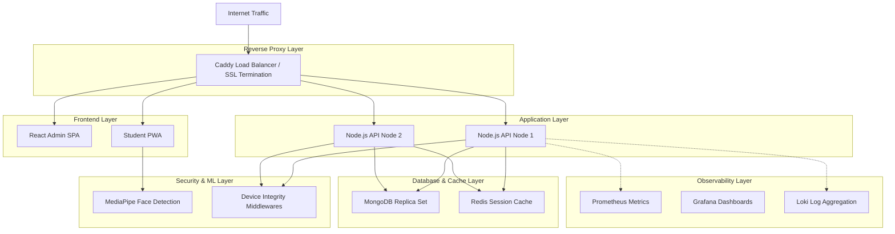
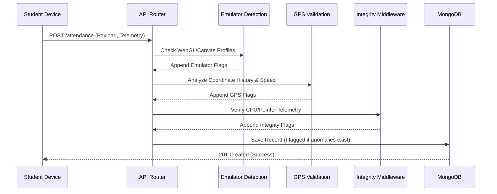
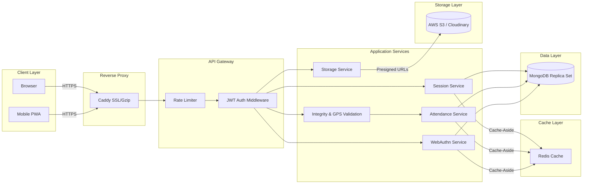

# Geotag-Based Attendance System

[](https://nodejs.org/)
[](https://www.mongodb.com/)
[](https://reactjs.org/)
[](https://www.typescriptlang.org/)
[](https://www.docker.com/)
[](https://prometheus.io/)
[](https://grafana.com/)
[](LICENSE)

[](backend/tests/)
[](backend/tests/)
[](https://webauthn.io/)
[](https://developers.google.com/mediapipe)

A production-ready attendance system integrating high-accuracy GPS geolocation, facial recognition, WebAuthn biometric authentication, and comprehensive device integrity verification. Built to scale for high concurrency environments using Node.js, React, and MongoDB.

---

## System Overview

The Geotag-Based Attendance System is designed for academic and corporate environments requiring indisputable proof of presence. It ensures that users are physically present at a designated location using a combination of strict GPS boundaries (geofencing), biometric hardware verification (WebAuthn), real-time facial detection (MediaPipe), and device anti-tampering heuristics.

The system employs an "Observer Pattern" for security enforcement: anomalies (such as emulator usage or GPS spoofing) do not outright block the user from submitting attendance, but instead securely flag the record for administrative review. This guarantees a frictionless user experience while providing administrators with total auditing visibility.

---

## Table of Contents

- [System Overview](#system-overview)
- [Core Features](#core-features)
- [Architecture & Data Flow](#architecture--data-flow)
- [Device Security & Integrity](#device-security--integrity)
- [Workflows](#workflows)
- [Installation & Deployment](#installation--deployment)
- [Observability](#observability)
- [API Documentation](#api-documentation)
- [Development Guide](#development-guide)
- [License](#license)

---
## Core Features

- **WebAuthn Biometrics**: Hardware-level authentication (Face ID, Touch ID, Windows Hello) to prevent credential sharing and impersonation.
- **Geofence Validation**: High-accuracy coordinate checking against dynamic administrative perimeters.
- **Facial Detection**: Real-time bounding-box face detection via MediaPipe during photo capture.
- **Device Integrity Pipeline**: Client and server-side heuristics to detect Android/iOS emulators, mock locations, and CPU timing manipulations.
- **Administrative Security Review**: Advanced dashboard for bulk verification, session filtering, and anomaly investigation.
- **Centralized Observability**: Integrated Prometheus, Grafana, and Loki stack for system telemetry and log aggregation.
- **Enterprise Storage**: S3-compatible cloud storage for secure, presigned, direct-to-bucket photo uploads.

---

## Architecture & Data Flow

### System Architecture



### Security Middleware Data Flow



### Data Flow Architecture



---

## Device Security & Integrity

The system runs a multi-layered security pipeline to guarantee submission authenticity.

### Client-Side Heuristics
- **Pointer Event Verification**: Detects automated scripts by validating touch points versus user-agent declarations.
- **Timing Manipulation**: Detects clock tampering by benchmarking standard computational loops against `performance.now()`.
- **MediaPipe Verification**: Client-side ML models verify human facial presence before upload presigned URLs are generated.

### Server-Side Middlewares
- **Emulator Detection**: Analyzes WebGL renderer strings, canvas capabilities, and device memory signatures to flag Android/iOS emulators.
- **GPS History Service**: Tracks sequential submissions to calculate travel speed. Submissions requiring impossible velocities (e.g., traveling 5km in 2 seconds) are flagged.
- **Mock Location Detection**: Flags perfectly uniform coordinates or missing altitude/heading data typical of GPS spoofing applications.

---

## Workflows

### Administrative Workflow
1. **Infrastructure Setup**: Define physical locations via coordinates and radius.
2. **Session Generation**: Initialize time-bound attendance sessions linked to a location.
3. **Distribution**: Share securely generated short links or QR codes.
4. **Monitoring**: Track real-time attendance influx via the session dashboard.
5. **Security Review**: Investigate the Security Review panel for flagged anomalies. Filter sessions by date and location.
6. **Verification**: Execute single or bulk verifications for legitimate records.

### Student Workflow
1. **Access**: Open the shared short-link via a mobile device.
2. **Authentication**: Input roll number and complete hardware WebAuthn biometric verification.
3. **Capture**: Grant camera permissions, center face for MediaPipe detection, and capture live photo.
4. **Geolocation**: Grant location permissions to establish geofence compliance.
5. **Submission**: Submit payload. Background integrity checks execute silently.

---

## Installation & Deployment

### Prerequisites
- Docker and Docker Compose
- Node.js 22.x (For local development without containers)
- AWS S3 compatible storage (or Cloudinary)

### Automated Setup (Recommended)

Use the provided setup script for a guided installation:

```bash
# Make the script executable
chmod +x setup.sh

# Run the interactive menu
./setup.sh menu

# Or use command-line options
./setup.sh check     # Check system requirements
./setup.sh install   # Install Docker, Node.js, and dependencies
./setup.sh up        # Start Docker Compose
./setup.sh help      # Show all available commands
```

**Setup Script Features:**
- Cross-platform support (Linux Ubuntu/Debian & macOS Intel/Apple Silicon)
- Installs Docker & Docker Compose (if not present)
- Installs Node.js 22 LTS via NVM (if not present)
- Detects existing versions and warns without overwriting
- Installs project dependencies
- Creates .env file from .env.example
- Interactive menu and CLI options

### Quick Start via Docker

1. Clone the repository and configure the environment:
```bash
git clone <repository-url>
cd Attendence-GEOTAG-System
cp .env.example .env
```

2. Configure primary environment variables within `.env`:
```env
# Infrastructure
NODE_ENV=production
PORT=5000
MONGODB_URI=mongodb://mongo:27017/attendance
REDIS_URL=redis://redis:6379

# Secrets
JWT_SECRET=your_secure_jwt_secret
ADMIN_SECRET=your_secure_admin_secret

# Storage (S3 Configuration)
STORAGE_PROVIDER=s3
AWS_S3_BUCKET=your-bucket-name
AWS_REGION=us-east-1
AWS_ACCESS_KEY_ID=your-access-key
AWS_SECRET_ACCESS_KEY=your-secret-key

# WebAuthn
WEBAUTHN_RP_NAME=Corporate Identity Provider
WEBAUTHN_RP_ID=your-domain.com
WEBAUTHN_ORIGIN=https://your-domain.com
```

3. Deploy the stack:
```bash
docker-compose up -d --build
```
This commands provisions the Backend API, Admin Frontend, Student PWA, MongoDB Replica Set, Redis cache, and the entire Prometheus/Grafana observability stack.

4. Create Admin Account:
```bash
curl -X POST http://localhost:5000/api/admin/register \
  -H "Content-Type: application/json" \
  -d '{
    "username": "admin",
    "email": "admin@example.com",
    "password": "admin123",
    "adminSecret": "your-admin-secret"
  }'
```

---

## Observability

The project includes an embedded telemetry stack for production monitoring.

- **Prometheus**: Scrapes application metrics (CPU usage, memory heap, request latency, concurrent active sessions) on port `:9090`.
- **Grafana**: Pre-configured dashboards visualizing API health, anomaly detection rates, and system integrity scores, accessible on port `:3001`.
- **Loki & Promtail**: Aggregates application logs, streamlining debugging and security audits. Configured to persist logs to the unified S3 bucket.

---

## API Documentation

The REST API utilizes standard HTTP verbs and JSON payloads. Admin routes require a Bearer JWT.

### Administrative Endpoints
- `POST /api/admin/login` - Issue JWT for administrative access.
- `POST /api/admin/locations` - Provision a new geofenced location.
- `POST /api/admin/sessions` - Initialize an attendance session.
- `GET /api/admin/sessions/:id/security-flags` - Retrieve aggregated anomaly metrics for a session.
- `PUT /api/admin/attendance/verify/bulk` - Execute bulk verification state changes.

### Student Endpoints
- `POST /s/:shortCode/webauthn/register/start` - Initiate hardware biometric registration.
- `POST /s/:shortCode/webauthn/auth/finish` - Conclude biometric verification.
- `POST /api/attend/:token/upload-url` - Request an S3 presigned URL for direct image upload.
- `POST /api/attend/:token` - Finalize attendance submission containing GPS coordinates and photo references.

---

## Development Guide

### Local Development Setup

To run the application services directly on the host machine:

#### Backend
```bash
cd backend
npm install
npm run dev
```

#### Admin Frontend
```bash
cd frontend/admin
npm install
npm run dev
```

#### Testing
The system maintains a comprehensive suite of unit and integration tests using Jest and Vitest.
```bash
# Run backend tests
cd backend && npm test

# Run student frontend integration tests
cd frontend/student && npm test
```

---

## License

This project is licensed under the MIT License. Please review the `LICENSE` file in the repository root for details.
